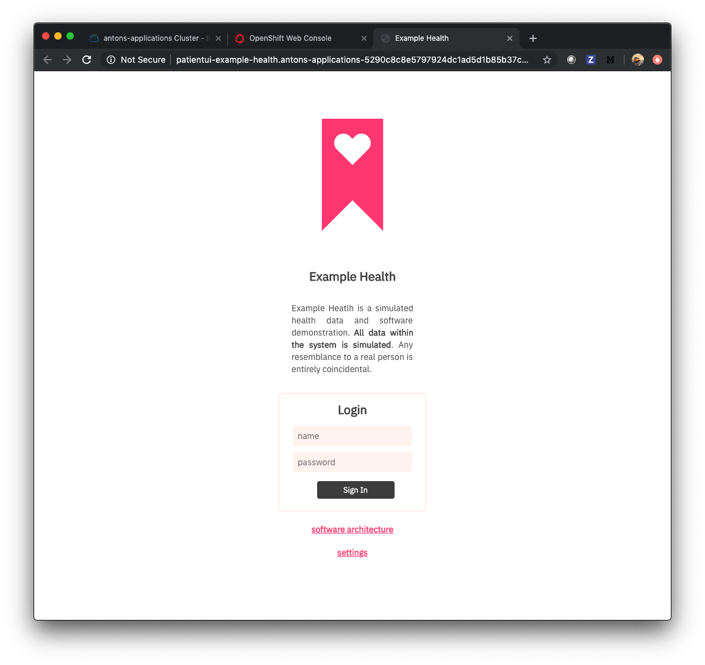

# Patient Health Records - App Modernization with RedHat OpenShift

This project is a patient records user interface for a conceptual health records system. The UI is programmed with open standards JavaScript and modern, universal CSS, and HTML5 Canvas for layout.

The UI is served by a simple Node.JS Express server, and the overall project goals are:

- to use the project to show a step by step guide of deploying the app on OpenShift Source to Image ( S2I ). Also we have modified the source code to integrate a Jenkins pipeline to build this image.
- to illustrate the versatility of Kubernetes based micro services for modernizing traditional applications - for instance mainframe based applications, or classic Java app server applications
- to experiment and explore open standards front end technologies for rendering custom charts, and for responsive design.

This project has been modified to integrate automatically with a JAVA API.


#### Example Health Background Story

Example Health is a pretend, conceptual healthcare/insurance type company. It is imagined to have been around a long time, and has 100s of thousands of patient records in an SQL database connected to a either a mainframe, or a monolithic Java backend.

The business rules for the system is written in COBOL or Java. It has some entitlement rules, prescription rules, coverage rules coded in there.

Example's health records look very similar to the health records of most insurance companies.

Here's a view a client might see when they log in:


Example Health business leaders have recently started understanding how machine learning using some of the patient records, might surface interesting insights that would benefit patients. There is lots of talk about this among some of the big data companies.

https://ai.googleblog.com/2018/05/deep-learning-for-electronic-health.html

https://blog.adafruit.com/2018/04/16/machine-learning-helps-to-grok-blood-test-results/

[ concept screenshot to come ]

Example has also heard a lot about cloud computing. There is a lot of traditional code in the mainframe and in classic Java app servers. It works well for now ... but some of the software architects think it may be complimentary to explore some machine learning, and to accelerate development of new user interfaces in the cloud ( either public or private )


#### Project aims

In this repo there is a patient user interface. It is written using plain HTML, CSS and JavaScript served from a Node.js microservice. The code runs by default with test/demo data, that doesn't rely on a more sophisticated server. The following installation steps can help you easily deploy this using OpenShift S2I ( source to image ).

### Run Locally using Docker

This image can be run locally using the `Dockerfile` on this repository. Make sure you have docker installed. 

First step is to construct the image.
```
$ docker build -t health-ui .
```

Once the building of the image has been completed. Let's run the container image:
```
$ docker run -d -p 8080:8080 health-ui
```

Open a browser and go to `http://localhost:8080`.You should be able to enter to the app.

#### Manual Deploy

We will create a build for our docker image

```
oc new-build --strategy docker --binary --name health-ui
```
Next, we are going to start the build of the image:
```
oc start-build health-ui --from-dir . --follow
```
Finally, we will deploy our image
```
oc new-app health-ui -e MODE="MODE.OPENSHIFT" -e API_URL="http://health-api:9080/"
```
Note: API should be running to work with the env variables.

#### Manual Deploy using S2I

You must have created your secret with the credentials to your git repository and must be logged in to the cluster.

S2I uses a base image (in this case we will use NodeJS) and a source code repository to create a Deployment of the app. To build our app run the following:

First step is to create the app using S2I. We will use our forked repo, and our secret. This will create a DeploymentConfig, ImageStream, Service and a BuildConfig.

```
$ oc new-app nodejs:10~<myrepo> \
    --context-dir=site/ \
    --source-secret=<mysecret> \
    --name=health-ui
``` 

Next step is to expose our app through a route.
```
$ oc expose svc/health-ui
```

To obtain the URL of the route we will use the following command:
```
$ oc get route
```

Open a browser and navigate to the URL you obtained:


You can enter any strings for username and password, for instance test/test... because the app is just running in demo mode.

And you've deployed a Node.js app to Kubernetes using OpenShift S2I.

#### Depoloy App using JenkinsPipeline Strategy

To run a pipeline deploy is required that your project has a jenkins running inside the cluster, otherwise it will not start the execution.
We will use a JenkinsPipeline Strategy to deploy the app. This pipeline has 2 stages:
1. Builds a new image if the DC for the app exists.
2. Deploys the app if it does not exist.


We have defined our pipeline inside `jk/pipeline.yaml`. Steps to run our pipeline:
1. Create our BuildConfig resource
   ```
   $ oc create -f jk/pipeline.yaml
   ```
2. Next step is to run our pipeline.
   ```
   $ oc start-build ui-pipeline
   ```
   Wait to the pipeline to finish and you will see Admin app running.

####  DevOps Pipeline

After we have our pipeline to depoloy our app. Next step is to integrate more DevOps Tools to automatiza the tools
